# tensorflow-基础入门
学习tensorflow的基本用法，并完成CNN识别手写数字

整个项目在Google Colaboratory上运行，也可在本地环境Anaconda中运行。

在Google Colab中，默认使用 `tensorflow 2.x` ，若想要使用切换 `1.x` 版本
```jyputer notebook
  %tensorflow_version 1.x
```

在Google Colab中使用`tensorboard`:
```jyputer notebook
  # 重新使用tensorboard时，使用 reload
  %load_ext tensorboard
  %tensorboard --logdir someDir
```

### 环境安装
+ 本地环境
  - `Anaconda` 开源的Python发行版本，内含很多科学依赖包。
  - `tensorflow` 端到端开源机器学习平台。
  ```
    # 在命令提示行中：
    # 创建虚拟环境
    conda create -n tensorflow python=3.6
    # 激活该环境
    conda activate tensorflow
    # 安装tensorflow 1.x 版本
    pip install tensorflow=1.14
  ```
+ 使用线上 `Google Colaboratory`
  - 新建 Colab 笔记本
  - 使用 `tensorflow 1.x`
  ```
    %tensorflow_version 1.x
  ```


### `tensorflow` 简单介绍
+ 使用图（graphs）来表示计算任务，包含了一个计算任务中的所有变量和计算方式
+ 使用tensor表示数据
+ 图中的节点称之为 OP(operation) 节点，一个OP获得0或多个tensor，执行计算，产生tensor
+ 在被称之为会话（Session）的上下文（context）中执行图

    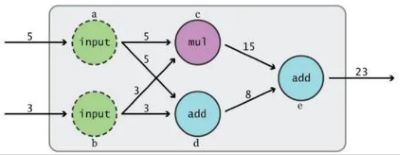


### 简单线性模型预测
+ y = k * x + b
+ 根据输入的(x, y)的数据组，预测 k 和 b 的值
```python
  # 定义 b 和 k
  b = tf.Variable(11.1`)
  k = tf.Variable(22.2`)

  # 二次代价函数
  loss = tf.reduce_mean(tf.square(y_data-y))
  # 使得 loss 最小化
  train = tf.train.GradientDescentOptimizer(0.2).minimize(loss)

  # 在会话 Session 中训练
  pass  # 参考 2-4-tf_eg.py
```


### 训练手写数据集分类
+ 使用tensorflow中的数据集：60000张图片，每一张图片包含28*28个像素。
  ```python
    #载入数据集
    from tensorflow.examples.tutorials.mnist import input_data
    mnist = input_data.read_data_sets("MNIST_data/",one_hot=True)
  ```
  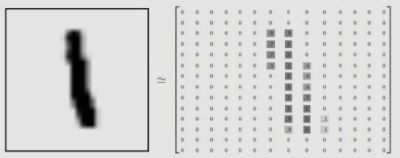
  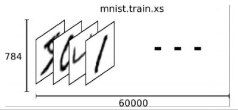
+ 构建一个输入 784 输出 10 的神经网络  
  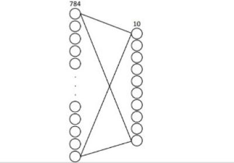

+ 使用交叉熵损失函数
  ```python
    loss = tf.reduce_mean(tf.nn.softmax_cross_entropy_with_logits(labels=y,logits=prediction))
  ```
+ 计算准确率
  ```python
    #结果存放在一个布尔型列表中
    correct_prediction = tf.equal(tf.argmax(y,1),tf.argmax(prediction,1))
    #argmax返回一维张量中最大的值所在的位置
    #求准确率
    accuracy = tf.reduce_mean(tf.cast(correct_prediction,tf.float32))
  ```

### 选择不同的优化器
+ `tf.train.GradientDescentOptimizer`
+ `tf.train.AdadeltaOptimizer`
+ `tf.train.AdagradOptimizer`
+ `tf.train.MomentumOptimizer`
+ `tf.train.AdamOptimizer`
+ `tf.train.RMSPropOptimizer`
+ __计算公式不予介绍__


### `tensorboard` 的使用
+ 在命令行中使用
  ```
    tensorboard --logdir=your_dir --host=127.0.0.1
  ```

+ `tf.name_scope()` 主要结合 `tf.Variable()` 来使用，方便参数命名管理
  ```python
    with tf.name_scope('weights'):
        W = tf.Variable(tf.zeros([784,10]), name='W')
  ```
  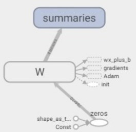  
+ 全部的可视化结构  
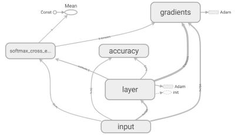


+ 观察到各变量和数值的变化
  ```python
    tf.summary.scalar('accuracy', accuracy)
    tf.summary.scalar('mean', mean)
  ```
  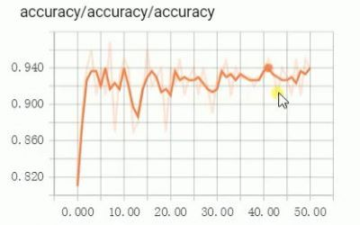
  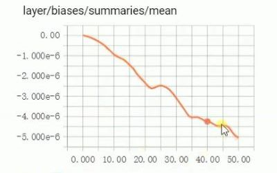 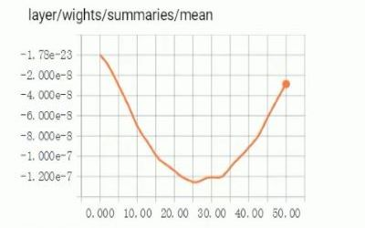


### 卷积神经网络（CNN）
+ 传统神经网络存在问题
  - 权值太多，计算量太大
  - 需要大量样本进行训练
+ CNN
  - 通过感受野和权值共享减少了神经网络需要训练的参数个数
  

  - 池化：压缩输入的特征图，减少了参数，简化了复杂度（去除杂余信息，保留关键信息）
  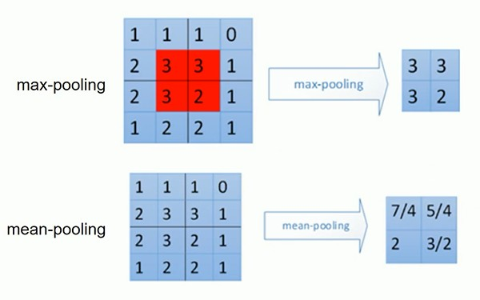

  - 卷积操作
    + SAME PADDING
      - 给平面外部补0
      - 卷积窗口采样后得到一个跟原来平面大小相同的平面
    + VALID PADDING
      - 不会超出平面外部
      - 卷积窗口采样后得到一个比原来平面小的平面
  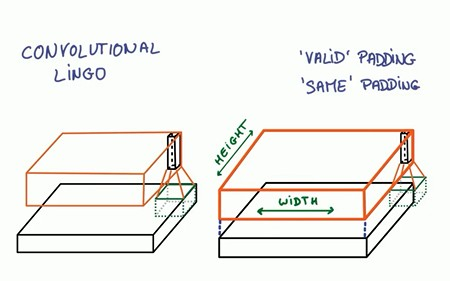
  
  - 池化操作
    + SAME PADDING
      - 可能给平面外部补0
    + VALID PADDING
      - 不会超出平面外部
    + 假如有一个2x3的平面，用2x2并且步长为2的窗口对其进行pooling操作
      — 使用SAME 得到1x2的平面
      — 使用VALID 得到1x1的平面
      
+ 代码实现
  ```python
    #卷积层
    def conv2d(x,W):
      #x input tensor of shape `[batch, in_height, in_width, in_channels]`
      #W filter / kernel tensor of shape [filter_height, filter_width, in_channels, out_channels]
      #`strides[0] = strides[3] = 1`. strides[1]代表x方向的步长，strides[2]代表y方向的步长
      #padding: A `string` from: `"SAME", "VALID"`
      return tf.nn.conv2d(x,W,strides=[1,1,1,1],padding='SAME')

    #池化层
    def max_pool_2x2(x):
      #ksize [1,x,y,1]
      return tf.nn.max_pool(x,ksize=[1,2,2,1],strides=[1,2,2,1],padding='SAME')

  ```
  1. 将图片转换为 28*28 通道（特征平面）为1  
    `x_image = tf.reshape(x,[-1,28,28,1],name='x_image')`
  2. 5*5的采样窗口卷积1，输出32个卷积核（特征平面）
    `conv2d_1 = conv2d(x_image, weight_variable([5,5,1,32])) + b_conv1`
  3. 使用激活函数relu，进行池化变成14*14
    `h_pool1 = max_pool_2x2(tf.nn.relu(conv2d_1))`
  4. 5*5的采样窗口卷积2，输出64个卷积核（特征平面）
    `conv2d_2 = conv2d(h_pool1, weight_variable([5,5,32,64])) + b_conv2`
  5. 重复卷积池化成7\*7，通道数为64 即是：7\*7*64
  6. 扁平化，全连接层


### `RNN` & `LSTM`
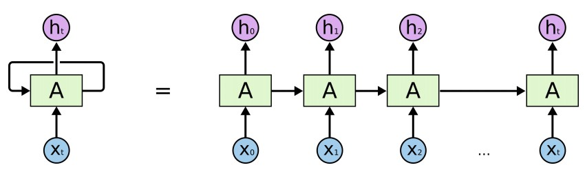
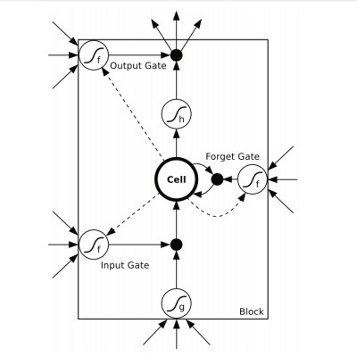

+ `RNN` 特点
  - 层间神经元也有连接（主要为隐层）
  - 共享参数
  - 在处理长序列数据时，极易导致梯度消失问题。
+ `LSTM` 特点
  - 增加一条贯穿与链上的信息传送带，称为细胞状态（cell state）
  - 通过三个门结构来维护cell state上的信息。
  - 对上一个节点的输入选择性忘记
  - 对该节点的输入选择性记忆
  - 决定哪些被当做当前状态的输出
